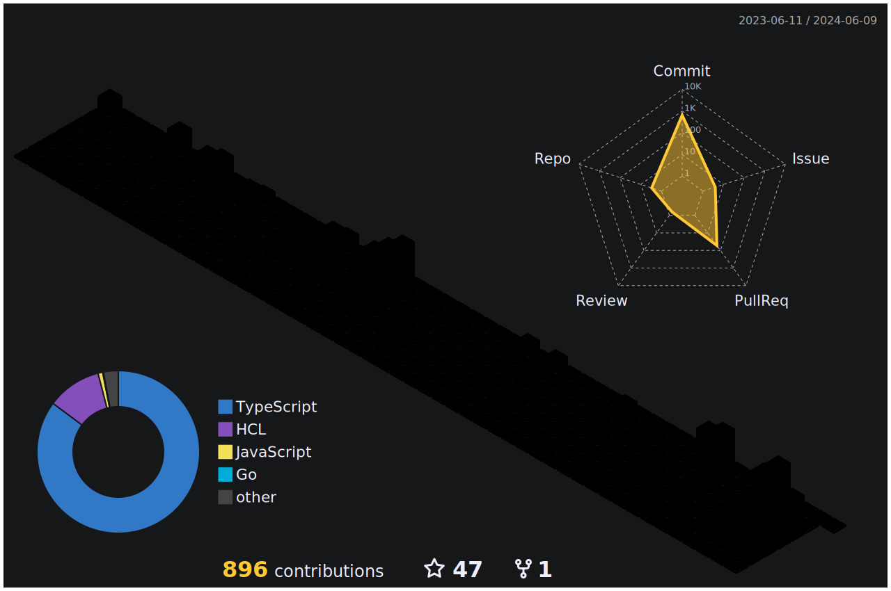

##

## Opa!! Bom te ver aqui. :balloon:
<h4>Prazer,</h4>
meu nome é Rafael, sou desenvolvedor Full Stack/Devops e aqui você encontra alguns registros dessa trilha.
E como eu quero o próximo projeto sempre melhor que o último ela não acabará.

##
Hobbies: :guitar: Violão. :runner: Corrida. :microscope: Física.

Sonho: :bulb: Fazer algo novo, que ajude o mundo.

Atualmente: :telescope: Descobrindo cada dia mais. :coffee: Tomando mais café também!

<h1></h1>

<a href="https://styled-components.com/">
<code></code>
</a>
<a href="https://www.typescriptlang.org/">
<code></code>
</a>
<a href="https://docs.github.com/pt/actions">
<code></code>
</a>
<a href="https://aws.amazon.com/pt/?nc2=h_lg">
<code></code>
</a>
<a href="https://pt-br.reactjs.org/">
<code></code>
</a>
<a href="https://nodejs.org/en/">
<code></code>
</a>
<a href="https://jestjs.io/pt-BR/">
<code></code>
</a>
<a href="https://www.cypress.io/">
<code></code>
</a>
<a href="https://www.postgresql.org/">
<code></code>
</a>
<a href="https://www.mongodb.com/pt-br">
<code></code>
</a>
<a href="https://redis.io/">
<code></code>
</a>
<a href="https://www.docker.com/">
<code></code>
</a>
  

<h1></h1>

  <h1></h1>
  

  
   
  

