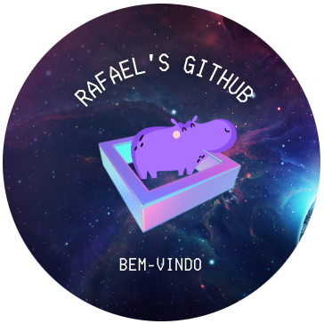

<h2>Opa!! Bom te ver aqui.</h2>

<h4> Me chamo Rafael, sou desenvolvedor Full Stack e aqui veremos alguns projetos dessa trilha.</h4>

 Ps.: Como quero o próximo projeto sempre melhor que o último, ela não acabará.

<h4>Hobbies:</h4>

:guitar: Violão. :runner: Corrida. :microscope: Física.

<h4>Sonho:</h4>

:bulb: Fazer algo novo, que ajude o mundo.

<h4>Atualmente:</h4>

:telescope: Descobrindo cada dia mais. :coffee: Tomando mais café também!

<h1></h1>
<code></code>
<code></code>
<code></code>
<code></code>
<code></code>
<code></code>
<h1></h1>

  <h1></h1>
   
 
