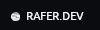
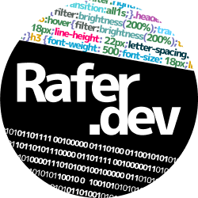
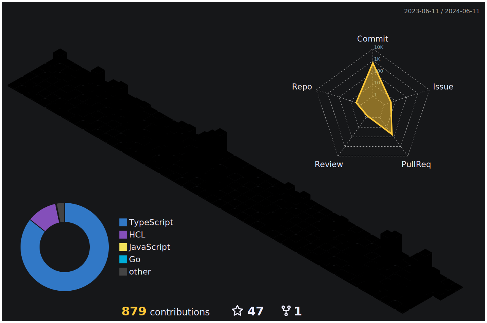

#### Lover of open source and open source tools 

[Why should whe colaborate and be kind (in all aspects)?](https://www.youtube.com/watch?v=mScpHTIi-kM)

##

About

 
##
 

##
  
<h4>It's a pleasure,</h4>
my name is Rafael, i'm Full Stack/Devops and here you will found some records of this trail.
And how i want this projects always better than the lattest this trail never ends.

##
Hobbies: :guitar: Acoustic Guitar. :runner: Running. :microscope: Physics.

Dream: :bulb: Do something new, something which help people.

Now: :telescope: Every day discovering something brand new. :coffee: Drinking more coffee too!

<h1></h1>

Coding Dashboard

  
Contact Me

  

   

  

 ##
 ----
 

 
  
 

